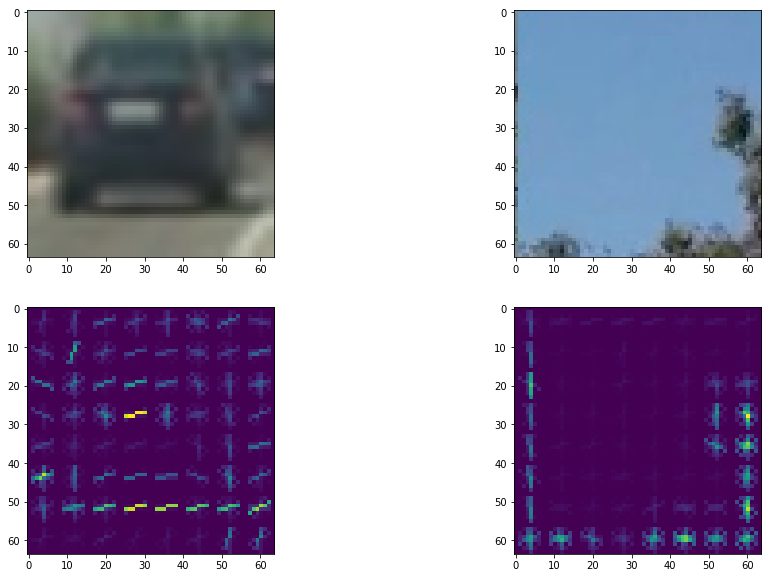
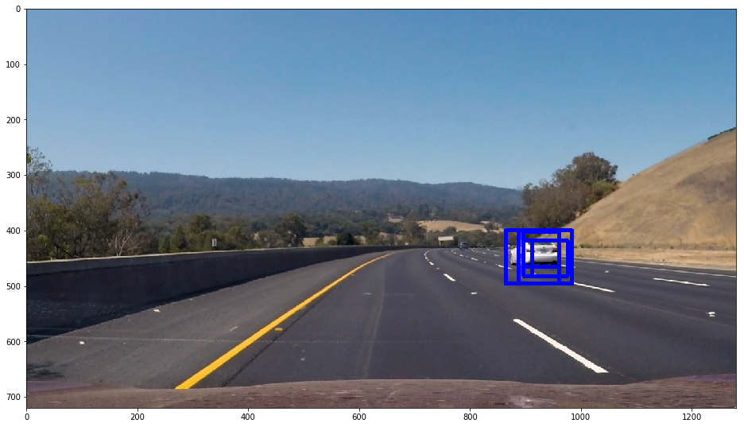
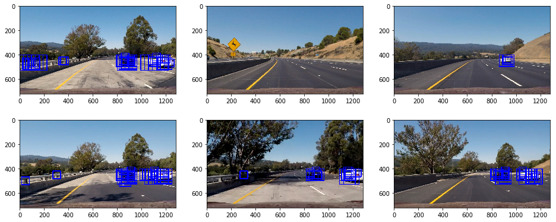
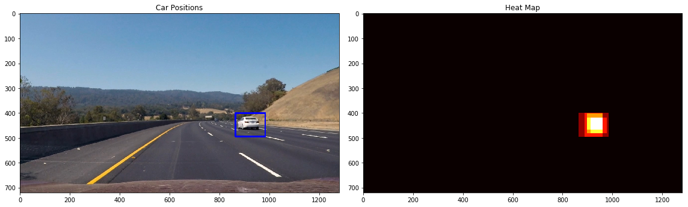
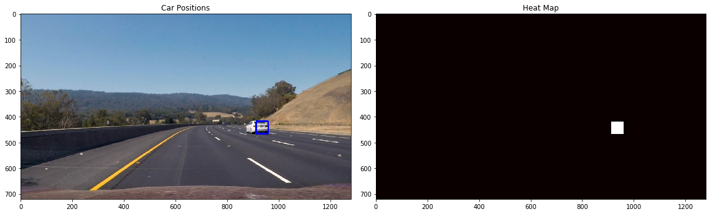

# Vehicle Detection Project

The goals / steps of this project are the following:

* Perform a Histogram of Oriented Gradients (HOG) feature extraction on a labeled training set of images and train a classifier Linear SVM classifier
* Optionally, you can also apply a color transform and append binned color features, as well as histograms of color, to your HOG feature vector. 
* Note: for those first two steps don't forget to normalize your features and randomize a selection for training and testing.
* Implement a sliding-window technique and use your trained classifier to search for vehicles in images.
* Run your pipeline on a video stream (start with the test_video.mp4 and later implement on full project_video.mp4) and create a heat map of recurring detections frame by frame to reject outliers and follow detected vehicles.
* Estimate a bounding box for vehicles detected.

## [Rubric](https://review.udacity.com/#!/rubrics/513/view) Points
### Here I will consider the rubric points individually and describe how I addressed each point in my implementation.  

---
### Writeup / README

#### 1. Provide a Writeup / README that includes all the rubric points and how you addressed each one.  You can submit your writeup as markdown or pdf.  [Here](https://github.com/udacity/CarND-Vehicle-Detection/blob/master/writeup_template.md) is a template writeup for this project you can use as a guide and a starting point.  

You're reading it!

### Histogram of Oriented Gradients (HOG)

#### 1. Explain how (and identify where in your code) you extracted HOG features from the training images.

I created vehicle and non vehicle training and test sets. Because the image are sampled from a video, I had to be careful to not put very similiar or consecutive frames from the video in the training and test set. This is a problem when training and testing a classifier, as it is easier to classify images that the classifier has already seen or are very similiar to images that the classifier has already seen. The images are ordered by by numbers in their filename. Images of similiar cars have close by numbers. So images will be sampled by their image numbers into a training and test set, so that there should be almost no similiar images in both sets. For each folder, selected the first 80% of image for training and the last 20% for testing.

Then there is a data preparation loop in the notebook right after the headline `Data Preparation` where the features for all the images are calculated. The HOG Features are calculated there as well.

Here is an example for the HOG Features for a vehicle and non vehicle image.

#### 2. Explain how you settled on your final choice of HOG parameters.

I used the YCrCb colorspace for the images. For HOG features I used 11 orientations with 8 pixels per cell und 2 cells per block. To be honest I was kind of lazy and looked in the forums for suggestions for the parameters.

I tried to lower the number of orientations and increase the pixel per cell sizes, but that screwed up the subsampling of hog features in the later stage, so I reverted the values.

#### 3. Describe how (and identify where in your code) you trained a classifier using your selected HOG features (and color features if you used them).

Training happens at the headline `Training the SVM` in the notebook. I trained a linear support vectore classifier. I used a grid search to find a good C parameter. 2 turned out to be the best one. Right now this is the only value tested in the gridsearch. I reran the notebook a lot of times and the gridsearch took a long time. As I already knew that 2 is the best parameter I fixed that in the grid search.

### Sliding Window Search

#### 1. Describe how (and identify where in your code) you implemented a sliding window search.  How did you decide what scales to search and how much to overlap windows?

I used the `find_cars` function implemented in the course to extract windows. I used the scales 1.0, 1.5 and 2. For the smallest scale of 1.0 only the middle section of the image from 350 pixels to 550 pixels on the y axis is scanned. The other scaled windows run from 400 to 650 pixels.

Here is an example of different boxes for the different scales detecting the white car.

#### 2. Show some examples of test images to demonstrate how your pipeline is working.  What did you do to optimize the performance of your classifier?

Ultimately I searched on three scales using YCrCb 3-channel HOG features plus spatially binned color and histograms of color in the feature vector, which provided a nice result.  Here are some example images:

You can see that there are some false positives espacially at the bridge area. Also sometimes cars on the oncoming lane are detected.

I didn't do anything to improve the classification results of the linear support vector classifier. Providing images of that bridge area as negative examples for training would be a good idea though.

---

### Video Implementation

#### 1. Provide a link to your final video output.  Your pipeline should perform reasonably well on the entire project video (somewhat wobbly or unstable bounding boxes are ok as long as you are identifying the vehicles most of the time with minimal false positives.)
Here's a [link to my video result](./video_out/project_video.mp4)

You can see that there are some false positives at the bridge area. Also detecting oncoming cars is quite confusing, but i thought it is cool that the model is able to do that and did not implement anything to ignore them. A better search area in the image could be a solution. Also the model looses the white car as it gets further away. I tried to use different color channels to prevent that, but that increased the number of false positives drastically.

#### 2. Describe how (and identify where in your code) you implemented some kind of filter for false positives and some method for combining overlapping bounding boxes.

The code find cars in the image frames is under the headline `Create a vehicleness heatmap` in the notebook. There is a function called `find_cars_in_image` which handles detection and discarding false postives.

Basically from the number of boxes where a vehicle was detected a heatmap is created.

Then a threashold is applied to the heatmap. At least 4 different boxes must be at the vehicle for the detection to not be discarded. This seems quite drastic, but otherwise there would be too many false positives.

For the video, the heatmaps of the last 10 frames are saved and an avarage heatmap of these last 10 frames is calculated.

I then used `scipy.ndimage.measurements.label()` to identify individual blobs in the heatmap.  I then assumed each blob corresponded to a vehicle.  I constructed bounding boxes to cover the area of each blob detected.  

---

### Discussion

#### 1. Briefly discuss any problems / issues you faced in your implementation of this project.  Where will your pipeline likely fail?  What could you do to make it more robust?

You can already see some problems and I discussed them in the earlier sections of this writeup. These are:

- False positives at the bridge area
	- Possible solution: Add as negative examples to trainign data.
- Oncoming traffic being detected
	- Possible solution: better search are
- Not detecting the white car when it is far.
	- Possible solution: Try to get rid of false positives and decrease the threshold.

Another issue is the runtime of the implementation. It is far from realtime. Each frame took about 1 second to be calculated.

Overall I'm not very happy with the results. I would like to implement a deep learning based approach like the YOLO network. But as with the previous projects, I ran out of time to try a very different approach.